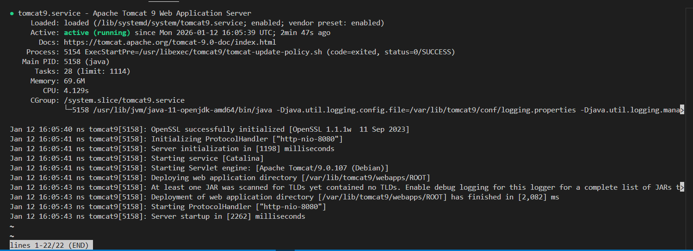
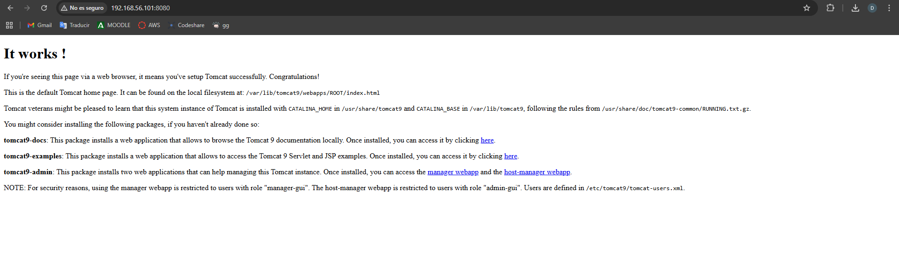
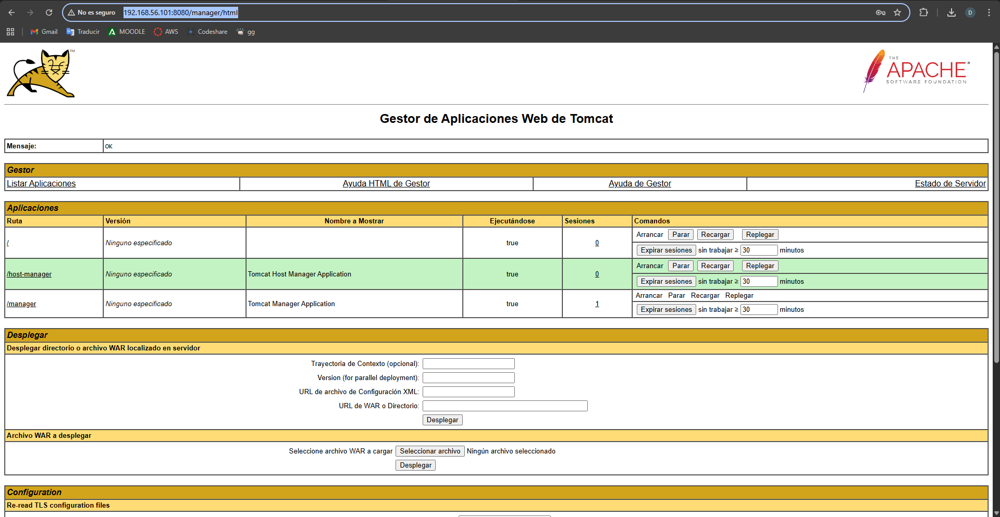
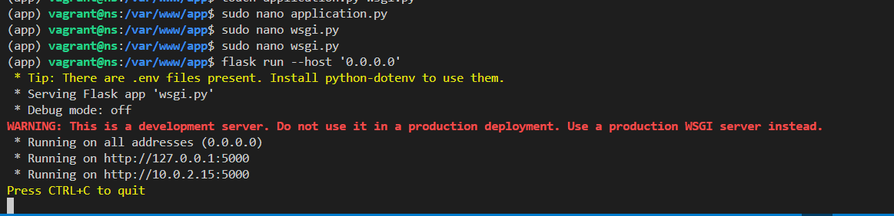
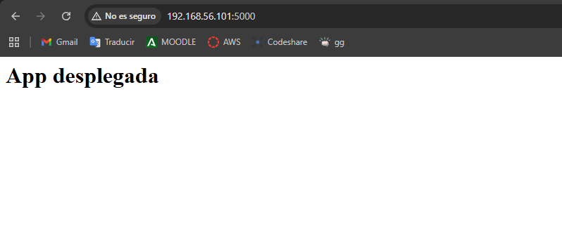
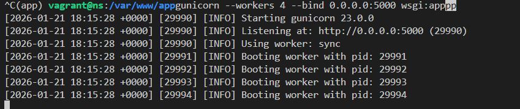
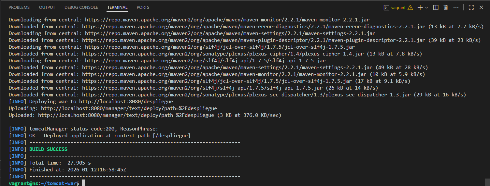
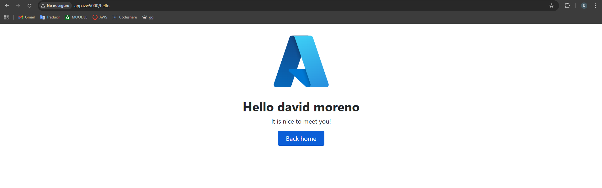

# Practica Realizada por :
DAVID MORENO LÓPEZ

# Despliegue de una aplicación Python con Flask y Gunicorn#
Para esta actividad he reutilizado los mismos archivos y Máquina Virtual que en Tomcat y Maven: Aplicaciones Java 


## DESPLIEGUE

El primer paso es descargar el gestor de paquetes de Python, el paquete Pinpenv, y  el paquete python-dotenv. Comprobamos que se ha instalado correctamente:



A continuación creamos el directorio del proyecto y le damos los permisos correspondientes:

Después creamos un archivo .env que contendrá las variables necesarias y ejecutamos nuestro entorno virtual:


Una vez dentro tenemos que instalar las dependencias necesarias y después ejecutamos el siguiente comando:
touch application.py wsgi.py

Se nos creará 2 archivos que tendremos que editar, y lo lanzamos :flask run --host '0.0.0.0'




Tras comprobarlo ejecutamos el comando para ver que todo está correcto:
```
gunicorn --workers 4 --bind 0.0.0.0:5000 wsgi:app
```


Ahora arrancamos el NGINX y creamos un archivo para que systemd corra Gunicorn 

Tras esto creamos un nuevo servicio de systemd:
```
systemctl enable flask_app
systemctl start flask_app
```


Y creamos el archivo app.conf con la siguiente configuracion:
```
server {
  listen 80;
  server_name app.izv www.app.izv;

  access_log /var/log/nginx/app.access.log;
  error_log /var/log/nginx/app.error.log;

  location / {
    include proxy_params;
    proxy_pass http://unix:/var/www/app/app.sock;
  }
}
```

Ahora lanzamos el NGINX y en C:\Windows\System32\drivers\etc\hosts tenemos que añadir nuestra IP:



## TAREA DE EVALUACIÓN ##
Ahora clonamos la carpeta del Github, y le damos los ajustes igual que en el ejemplo


