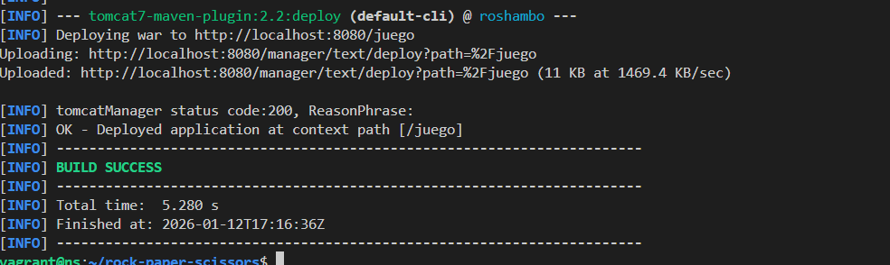
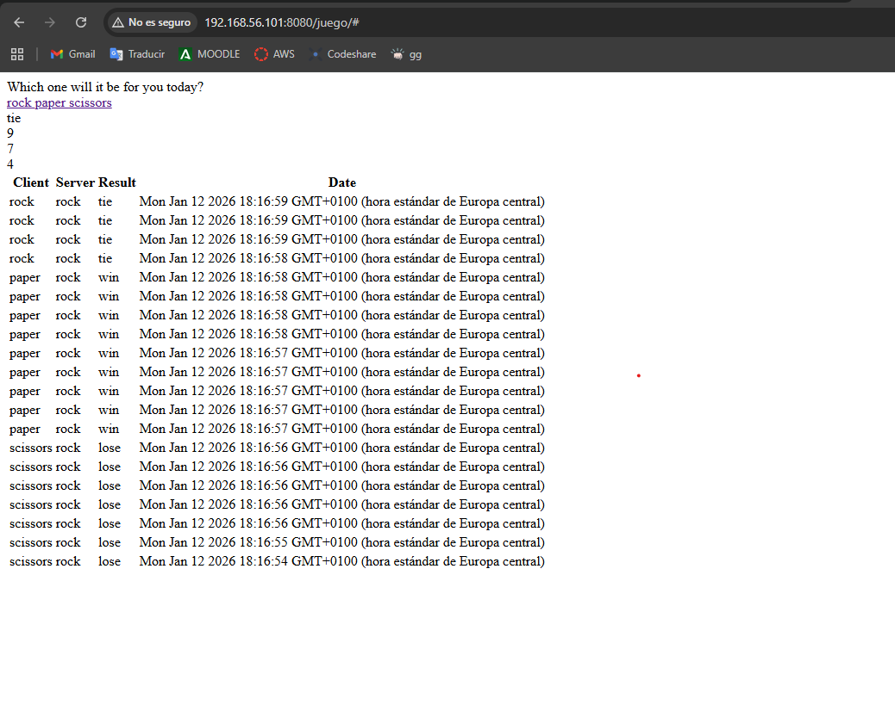

# Practica Realizada por :
DAVID MORENO LÓPEZ

# Practica Tomcat y Maven: Aplicaciones Java #
Primero para esta actividad he reutilizado la maquina virtual que creé en Nginx. El primer paso ha sido instalar tanto OpenJDK, como Tomcat (el cual ha habido que crear grupos y usuarios).

Tras esto lanzamos el servidor Tomcat y le hacemos status:


Pero al estar en una máquina virtual no podemos acceder al  http://localhost:8080/ para ver si funciona, asi que tenemos que modificar context.xml, y la ip para ver es esta: 192.168.56.101:8080


## Configuración de la administración ##
Tenemos que definir ahora el usuario con acceso a Tomcat, para ello tenemos que modificar el archivo tomcat-users.xml.

Tras esto instalamos el administrador web:
sudo apt install -y tomcat9-admin

Y entramos en: http://192.168.56.101:8080/manager/html donde podemos ver lo siguiente:


## Despliegue manual mediante GUI ##
Ahora en el administrador web tenemos que añadir el archivo WAR manualmente:


## Despliegue Maven ##
Debemos instalar maven:
sudo apt-get update && sudo apt-get -y install maven


Tras esto modificamos el tomcat-users.xml otravez para añadir otro usuario y los roles necesarios al usuario alumno.

Después se lo tenemos que indicar a maven con un identificador, modificamos /etc/maven/settings.xml  y añadimos:

```
<servers>
  <server>
    <id>Tomcat</id>

   <username>deploy</username>

   <password>1234</password>
  </server>
 </servers>
```

Tras esto ya podemos generar la aplicacion, con el siguiente comando:
```
mvn archetype:generate -DgroupId=org.zaidinvergeles \
                         -DartifactId=tomcat-war \
                         -Ddeployment \
                         -DarchetypeArtifactId=maven-archetype-webapp \
                         -DinteractiveMode=fa
```


Tras esto entramos en tomcat-war y tendremos que modificar el archivo pom.xml añadiendo contenido, despues ejecutamos el comando para lanzarlo:
mvn tomcat7:deploy


## Tarea ##
Todo esto ha sido en la aplicación de prueba, ahora con la Tarea, que para ello he tenido que instalar git y hacer el clone dentro de la máquina virtual, tras esto ha habido que cambiar el pom.xml añadiendo el bloque <plugin>. Después de haber hecho todo esto el juego de piedra papel y tijera está integrado:


